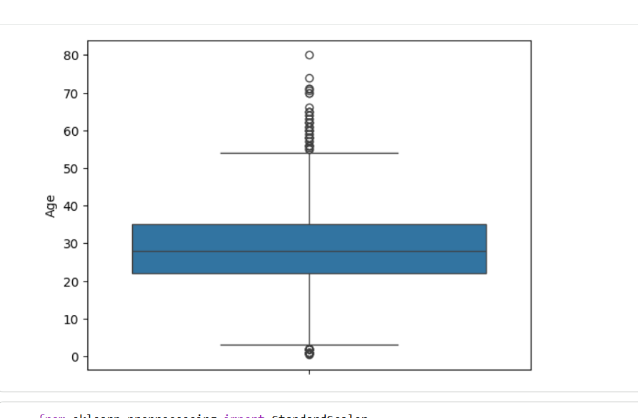

# Zynxis Machine Learning Internship – Week 2
## Data Preprocessing & Feature Engineering
### 👩‍💻 Intern Information
**Name:** Fiza Zahid Ali  
**Discipline:** Bachelor of Science in Artificial Intelligence (BSAI)  
**Internship:** Machine Learning Internship – Zynxis
---
## 📌 Weekly Objective

The objective of Week 2 was to understand and implement the complete data preprocessing pipeline required before training machine learning models. This involved cleaning a raw dataset, transforming features, engineering new features, and preparing the dataset for predictive modeling.
---

## 📂 Dataset Used

- **Dataset:** Titanic Dataset
- **Problem Type:** Classification
- **Target Variable:** Survived

---

## 📚 Topics Learned

During this week, I learned the importance of preprocessing data before building machine learning models. The following concepts were covered:

- Loading and exploring datasets using Pandas
- Understanding dataset structure using `head()`, `info()`, and `describe()`
- Identifying missing values
- Handling missing values using Median and Mode
- Removing unnecessary columns
- Encoding categorical variables
- Detecting and removing outliers using the IQR method
- Feature Scaling using StandardScaler
- Feature Engineering
- Comparing datasets before and after preprocessing
- Exporting the cleaned dataset

---

## 🛠 Tasks Performed

✔ Loaded the Titanic dataset

✔ Explored dataset structure and statistics

✔ Handled missing values

✔ Encoded categorical variables

✔ Removed unnecessary columns

✔ Detected and removed outliers

✔ Applied feature scaling

✔ Created new engineered features:
- FamilySize
- IsAlone
- FarePerPerson
- TicketGroup
- AgeGroup

✔ Compared the dataset before and after preprocessing

✔ Saved the cleaned dataset as a CSV file

---

## 📊 Feature Engineering

The following new features were created to improve the quality of the dataset:

| Feature | Description |
|---------|-------------|
| FamilySize | Total family members traveling together |
| IsAlone | Indicates whether the passenger was traveling alone |
| FarePerPerson | Fare divided by family size |
| TicketGroup | Number of passengers sharing the same ticket |
| AgeGroup | Categorized passengers into different age groups |

---

## 📁 Files Included

- `Week2_Preprocessing.ipynb`
- `Cleaned_Titanic.csv`
- `README.md`

---

# 📖 Weekly Progress Log

### What I Learned

This week helped me understand that data preprocessing is one of the most important stages of the machine learning pipeline. I learned how to clean raw data, handle missing values, encode categorical variables, remove outliers, normalize numerical features, and create meaningful engineered features. I also learned how to compare datasets before and after preprocessing to evaluate the impact of these transformations.
## 🎯 Skills Gained

- Python
- Pandas
- NumPy
- Data Cleaning
- Data Preprocessing
- Feature Engineering
- Data Visualization
- Scikit-learn
- StandardScaler
- Label Encoding
- One-Hot Encoding
## Before vs After Comparison

**Author:** Fiza Zahid Ali  
**Discipline:** BS Artificial Intelligence  
**Machine Learning Internship – Zynxis**
