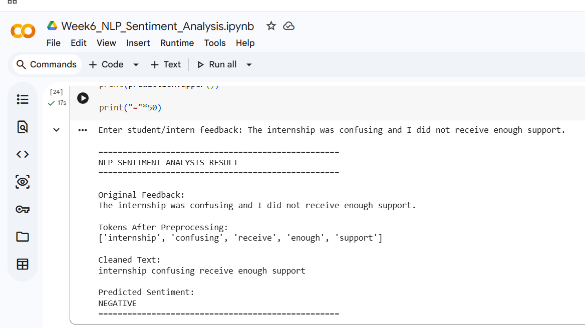
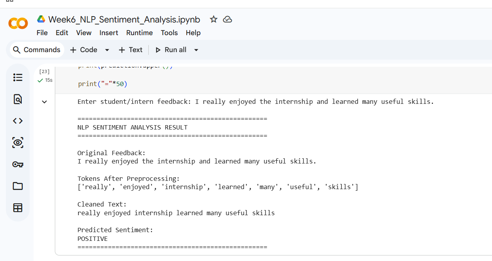

# Zynxis Machine Learning Internship — Week 6

## Natural Language Processing (NLP) — Sentiment Analysis

### 👩‍💻 Intern Information

**Name:** Fiza Zahid Ali  
**Discipline:** Bachelor of Science in Artificial Intelligence (BSAI)  
**Organization:** Zynxis  
**Internship:** AI / ML Internship  
**Week:** 6  
**Status:** Ongoing

---

## 📌 Task Overview

The objective of Week 6 was to build a Natural Language Processing (NLP) pipeline for analyzing student/intern feedback.

For this task, I selected **Sentiment Analysis** as the NLP problem.

The system takes student/intern feedback as text and predicts whether the feedback expresses a **positive** or **negative** sentiment.

---

## 🎯 Objectives

The main objectives of this task were to:

- Understand the fundamentals of Natural Language Processing
- Clean and preprocess textual data
- Perform tokenization
- Remove stopwords
- Convert text into numerical features using TF-IDF
- Train a Machine Learning classification model
- Evaluate the sentiment classification model
- Test the model with new text input
- Analyze the final prediction

---

## 🧠 NLP Pipeline

The complete pipeline developed in this task is:

```text
Raw Feedback
     ↓
Text Cleaning
     ↓
Lowercasing
     ↓
Tokenization
     ↓
Stopword Removal
     ↓
Cleaned Text
     ↓
TF-IDF Vectorization
     ↓
Logistic Regression
     ↓
## 🧪 Sample Input/Output Results

### Negative Feedback

The model was given negative internship feedback as input.



### Positive Feedback

The model was also tested using positive internship feedback.


Predicted Sentiment:

NEGATIVE
